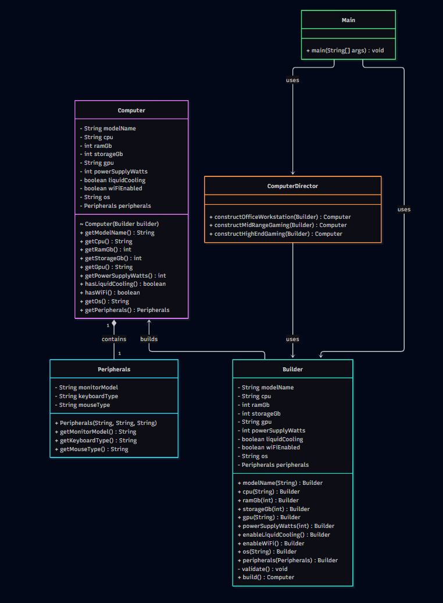

# Laboratory Work Report: Assignment 1 - Builder Pattern
**Course:** Software Design Patterns  
**Student Group:** SE-2518  
**Student Name:** Serik Bakdaulet  
**Domain:** Computer Configuration

---

## 1. Objective & Overview
The purpose of this assignment is to design and implement a complex object (`Computer`) using the **Builder Design Pattern**. This solves the telescoping constructor anti-pattern, provides a readable Fluent API through method chaining, enforces object consistency via strict single-field and cross-field validation, and applies Clean Code principles.

---

## 2. Individual Variant
* **Domain:** Computer Configuration
* **Individual Constraint:** High-end GPUs (e.g., "RTX 4090") require a power supply of at least 750W and active liquid cooling; otherwise, validation must fail.
* **Required Presets:** `Office Workstation`, `Mid-Range Gaming PC`, `High-End Gaming PC`.

---

## 3. Part A - The Design Problem (Initial Implementation)
Before refactoring to the Builder pattern, the initial version of the `Computer` class used a large conventional constructor containing over 10 parameters (4 required, 6 optional, across 3 data types, including a nested `Peripherals` value object).

### Concrete Design Problems:
1. **Readability & Maintenance:** Instantiating a computer with numerous boolean flags and strings required passing multiple `null` or `false` arguments in exact positions (e.g., `new Computer("Model", "Intel", 16, 512, null, 500, "ATX", false, false, "Windows", peripherals)`), making code extremely error-prone.
2. **Telescoping Constructor Anti-Pattern:** Providing overloads for every possible combination of optional parameters (GPU, Wi-Fi, Liquid Cooling, OS) led to explosive growth in constructor count.
3. **Weak Validation:** Enforcing cross-field rules (such as matching power supply constraints with high-end GPUs) inside a massive constructor was virtually impossible to maintain cleanly without nested conditional chaos.

---

## 4. Part B - Refactoring to Builder
The solution introduces a static nested `Builder` class inside `Computer`. The `Computer` constructor is made private, making the final Product completely **immutable** (all fields are `final`), ensuring thread safety.

* **Fluent API:** Configuration methods return `this` to allow seamless method chaining.
* **Domain-Specific Naming:** Methods like `.enableLiquidCooling()`, `.powerSupply(750)`, and `.withGpu("RTX 4090")` replace generic setters.

---

## 5. Part C - Validation Challenge
Validation is centralized inside the `Builder.build()` method. It checks:
1. **Single-Field Rules:**
   * `modelName` must not be blank or null.
   * `ramGb` must be within valid hardware boundaries.
   * `storageGb` must be positive.
2. **Cross-Field Rules (Individual Constraint):**
   * If `gpu` contains `"RTX 4090"`, then `powerSupplyWatts` must be $\ge 750$ **and** `liquidCooling` must be `true`. If violated, an `IllegalArgumentException` or `IllegalStateException` is thrown.

---

## 6. Part D - Preset Configurations (Director)
A `ComputerDirector` class was implemented to encapsulate the construction steps for standard presets, preventing code duplication:
* **Office Workstation:** Balanced specs with integrated graphics, 8GB RAM, and standard peripherals.
* **Mid-Range Gaming PC:** Dedicated mid-range GPU, 16GB RAM, 1TB storage.
* **High-End Gaming PC:** Top-tier components, liquid cooling, high wattage PSU, featuring the required console output with `🍌`.

---

## 7. Part E - Clean Code: Before $\rightarrow$ After
Applying principles from *Clean Code, Chapter 3*:

### Principle 1: Small Functions & Descriptive Naming
* **Before:** Large multi-purpose setup methods handling validation, default assignments, and object mapping all at once.
* **After:** Split into small, single-responsibility methods (`validateRam()`, `validatePowerSupply()`).
* **Why:** Improves testability and readability.

### Principle 2: Avoiding Flag Arguments
* **Before:** `configureCooling(boolean isLiquid)` where callers passed confusing `true`/`false` flags.
* **After:** Explicit domain methods `.enableLiquidCooling()` and `.enableAirCooling()`.
* **Why:** Clarifies intent instantly without checking documentation.

### Principle 3: Clear Error Handling
* **Before:** Returning `null` or printing stack traces on invalid configurations.
* **After:** Throwing descriptive `IllegalArgumentException` inside the builder's validation block.

---

## 8. Part F - Non-Trivial Design Decision
* **Decision:** Centralizing validation inside the `Builder.build()` method rather than inside the `Computer` product or individual setter methods.
* **Alternative Considered:** Validating incrementally inside each `.withX()` setter method.
* **Reasoning:** Incremental validation restricts the order of method chaining (e.g., validating GPU power before the power supply method has even been called). Validating inside `build()` allows setters to be called in *any* arbitrary order while guaranteeing that no incomplete or invalid `Computer` instance can ever escape into the application.

---

## 9. Part G - UML Diagram & Traceability Matrix

The UML class diagram is saved in the repository at `docs/builder-uml.png`.



| Builder Role | Your Class | Responsibility |
| :--- | :--- | :--- |
| **Product** | `Computer` | The complex immutable object being created; holds final hardware attributes. |
| **Concrete Builder** | `Computer.Builder` | Provides fluent setter methods and executes single/cross-field validation inside `build()`. |
| **Director** | `ComputerDirector` | Encapsulates reusable preset construction sequences (Office, Gaming). |
| **Component** | `Peripherals` | Value object representing bundled monitors and input devices. |
| **Client** | `ComputerTest` / `Main` | Initiates the building process and consumes the final product. |

---

## 10. Part H - Automated Testing & Sample Output
The test suite in `ComputerTest.java` contains **10 comprehensive tests** covering valid builds, invalid states, boundary cases, the individual constraint, and builder reuse independence. All tests pass successfully.

### Sample Console Output (High-End Preset):
```text
=== Running Computer Builder Demo ===
Built: Office Workstation with 8GB RAM
Built: Gaming Rig Mid with GPU RTX 4060
🍌 Ultimate Gaming PC successfully built!
Built: Ultimate Gaming PC (Power Supply: 850W)